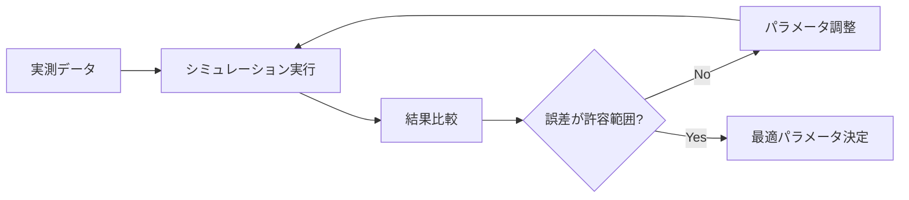
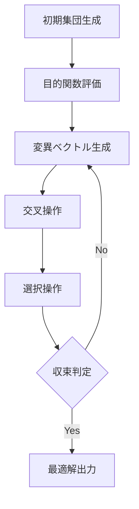

# キャリブレーション機能ガイド

## 目次

1. [概要](#概要)
2. [キャリブレーションとは](#キャリブレーションとは)
3. [実装アルゴリズム](#実装アルゴリズム)
4. [評価メトリックス](#評価メトリックス)
5. [調整可能パラメータ](#調整可能パラメータ)
6. [使用方法](#使用方法)
7. [ベストプラクティス](#ベストプラクティス)

## 概要

キャリブレーション機能は、シミュレーション結果を実測データに合わせるために、モデルのパラメータを自動的に調整する機能です。

### 主な特徴

- ✅ **2種類の最適化手法**
  - グリッドサーチ（パラメータサーベイ型）
  - 統計的最適化（Differential Evolution）
- ✅ **複数の評価メトリックス**
  - RMSE、MAE、MAPE、R²
- ✅ **季節別パラメータ調整**
  - 冬季・夏季・中間期で異なる設定値
- ✅ **視覚的な改善確認**
  - 元のシミュレーション vs キャリブレーション後のグラフ表示

## キャリブレーションとは

### 目的

シミュレーションモデルの予測精度を向上させるために、モデルパラメータを実測データに基づいて調整することです。

### プロセス



### 適用例

1. **新築ビル**: 設計値と実際の運用の違いを把握
2. **既存ビル**: 省エネ対策の効果予測精度を向上
3. **改修計画**: 現状を正確にモデル化し、改修効果を予測

## 実装アルゴリズム

### 1. グリッドサーチ（Grid Search）

#### 概要

指定したパラメータ範囲を等間隔に分割し、全ての組み合わせを試行する網羅的な探索手法です。

#### アルゴリズム

```python
for param1 in range(min1, max1, step1):
    for param2 in range(min2, max2, step2):
        for param3 in range(min3, max3, step3):
            # シミュレーション実行
            results = simulate(param1, param2, param3)
            # 誤差評価
            error = calculate_error(results, actual_data)
            # 最小誤差を記録
            if error < min_error:
                best_params = (param1, param2, param3)
                min_error = error
```

#### 特徴

**長所:**
- 全空間を探索するため、最適解を確実に見つけられる
- パラメータ間の相互作用を把握できる
- 実装がシンプルで理解しやすい

**短所:**
- パラメータ数が増えると計算時間が指数関数的に増加
- 3パラメータ×10分割 = 1,000回のシミュレーション
- 5パラメータ×10分割 = 100,000回のシミュレーション

#### 実装

**ファイル:** `backend/app/calibration.py:178-237`

**主要処理:**
1. パラメータグリッド生成
2. 全組み合わせの計算（最大1,000組み合わせに制限）
3. RMSE順にソート
4. 最良結果を返却

### 2. 統計的最適化（Differential Evolution）

#### 概要

進化的アルゴリズムの一種で、効率的に大域的最適解を探索する手法です。SciPyライブラリの`differential_evolution`を使用しています。

#### アルゴリズムの流れ



#### Differential Evolutionの特徴

**長所:**
- グリッドサーチより遥かに高速
- 多パラメータ（5個以上）でも効率的
- 局所最適解に陥りにくい
- パラメータ数に対して計算量がスケーラブル

**短所:**
- 確率的手法のため、実行ごとに結果が若干異なる
- 収束までの反復回数が予測困難
- 内部の動作がブラックボックス

#### 実装

**ファイル:** `backend/app/calibration.py:240-319`

**主要パラメータ:**
```python
differential_evolution(
    objective_function,
    bounds,
    maxiter=100,      # 最大反復回数
    seed=42,          # 再現性のため乱数シード固定
    workers=1,        # 並列ワーカー数
    updating='deferred',  # 更新戦略
    atol=1e-6,        # 絶対許容誤差
    tol=1e-6,         # 相対許容誤差
)
```

**目的関数:**
```python
def objective_function(x):
    """最小化する目的関数（RMSE）"""
    parameters = dict(zip(param_names, x))
    results_df = run_simulation(parameters)
    simulated, actual = extract_values(results_df)
    metrics = calculate_metrics(simulated, actual)
    return metrics.rmse
```

## 評価メトリックス

シミュレーション結果と実測データの乖離を定量的に評価するための指標です。

### 1. RMSE (Root Mean Square Error)

**二乗平均平方根誤差**

```
RMSE = √(Σ(y_sim - y_act)² / n)
```

**特徴:**
- 大きな誤差を重視（二乗のため）
- 単位は元データと同じ（kWh）
- 値が小さいほど良い

**実装:** `backend/app/calibration.py:62`

### 2. MAE (Mean Absolute Error)

**平均絶対誤差**

```
MAE = Σ|y_sim - y_act| / n
```

**特徴:**
- 全ての誤差を均等に評価
- 外れ値の影響を受けにくい
- 解釈が直感的

**実装:** `backend/app/calibration.py:65`

### 3. MAPE (Mean Absolute Percentage Error)

**平均絶対パーセント誤差**

```
MAPE = (Σ|y_sim - y_act| / y_act) / n × 100 [%]
```

**特徴:**
- 相対誤差で評価
- 異なるスケールのデータを比較可能
- 実測値が0に近いと不安定

**判定基準（一般的）:**
- MAPE < 10%: 非常に良好
- MAPE < 20%: 良好
- MAPE < 50%: 許容可能
- MAPE > 50%: 要改善

**実装:** `backend/app/calibration.py:68-72`

### 4. R² (Coefficient of Determination)

**決定係数**

```
R² = 1 - (SS_res / SS_tot)

SS_res = Σ(y_sim - y_act)²  # 残差平方和
SS_tot = Σ(y_act - ȳ_act)²   # 全平方和
```

**特徴:**
- 0～1の範囲（1に近いほど良い）
- モデルの説明力を表す
- 負の値も取りうる（モデルが平均より悪い場合）

**判定基準:**
- R² > 0.9: 非常に良好
- R² > 0.7: 良好
- R² > 0.5: 中程度
- R² < 0.5: 要改善

**実装:** `backend/app/calibration.py:75-77`

### 5. 最大誤差

```
max_error = max(|y_sim - y_act|)
```

**特徴:**
- 最も乖離が大きい月を特定
- 異常値の検出に有効

**実装:** `backend/app/calibration.py:80-82`

## 調整可能パラメータ

### 建物・設備パラメータ

| パラメータ | 説明 | 推奨範囲 | 影響 |
|-----------|------|---------|------|
| wall_u_value | 壁熱貫流率 | 0.1～1.0 W/m²K | 冷暖房負荷全体 |
| window_u_value | 窓熱貫流率 | 1.0～6.0 W/m²K | 冷暖房負荷全体 |
| solar_heat_gain_coef | 日射熱取得係数 | 0.1～0.9 | 冷房負荷（特に夏季） |
| lighting_power_density | 照明電力密度 | 5～20 W/m² | 照明エネルギー、冷房負荷 |
| oa_equipment_power_density | OA機器電力密度 | 5～30 W/m² | OAエネルギー、冷房負荷 |
| central_chiller_cop | 熱源COP | 2.0～6.0 | 全館空調エネルギー |
| local_ac_cop | 個別空調COP | 2.0～5.0 | 個別空調エネルギー |

**実装:** `frontend/src/components/ParameterSelector.tsx:10-18`

### 季節別運用パラメータ

#### 冬季（11-3月）

| パラメータ | 説明 | 推奨範囲 |
|-----------|------|---------|
| winter_indoor_temp_setpoint | 室温設定 | 18～24°C |
| winter_indoor_humidity_setpoint | 湿度設定 | 30～60% |
| winter_supply_air_temp | 給気温度設定 | 15～25°C |

**実装:** `frontend/src/components/ParameterSelector.tsx:20-23`

#### 夏季（7-9月）

| パラメータ | 説明 | 推奨範囲 |
|-----------|------|---------|
| summer_indoor_temp_setpoint | 室温設定 | 22～28°C |
| summer_indoor_humidity_setpoint | 湿度設定 | 40～70% |
| summer_supply_air_temp | 給気温度設定 | 12～20°C |

**実装:** `frontend/src/components/ParameterSelector.tsx:25-28`

#### 中間期（4-6, 10月）

| パラメータ | 説明 | 推奨範囲 |
|-----------|------|---------|
| mid_indoor_temp_setpoint | 室温設定 | 20～26°C |
| mid_indoor_humidity_setpoint | 湿度設定 | 35～65% |
| mid_supply_air_temp | 給気温度設定 | 14～22°C |

**実装:** `frontend/src/components/ParameterSelector.tsx:30-33`

### パラメータ選択のガイドライン

**影響度が大きいパラメータ:**
1. COP（熱源、個別空調）→ エネルギー消費に直接影響
2. 室温設定（季節別）→ 負荷量に直接影響
3. U値（壁、窓）→ 負荷量に影響

**調整しやすいパラメータ:**
- 季節別の室温設定、湿度設定、給気温度設定
- COPは実測が困難なため調整しやすい

**調整しにくいパラメータ:**
- U値は設計値が明確な場合が多い
- 照明・OA機器密度は実測可能

## 使用方法

### 1. 実測データの準備

#### 手動入力

1. キャリブレーションタブを開く
2. 実測データテーブルに12ヶ月分のデータを入力
   - 全館空調消費電力 [kWh]
   - 個別空調消費電力 [kWh]
   - 合計消費電力 [kWh]

#### CSVインポート

**CSVフォーマット:**
```csv
month,central_total_kWh,local_total_kWh,total_kWh
1,3200,2800,6000
2,2900,2600,5500
3,2600,2300,4900
...
```

**サンプルファイル:** `sample_actual_data.csv`

### 2. 比較実行

1. **比較対象**を選択
   - 合計消費電力
   - 全館空調消費電力
   - 個別空調消費電力

2. **「実測と比較」ボタン**をクリック

3. **結果確認**
   - グラフで視覚的に確認
   - メトリックス（RMSE、MAE、MAPE、R²）を確認
   - 乖離が大きい月を特定

### 3. キャリブレーション実行

#### Step 1: パラメータ選択

1. **「パラメータ追加」ボタン**をクリック
2. 調整したいパラメータを選択
3. 範囲を設定
   - 最小値
   - 最大値
   - 分割数（グリッドサーチの場合）

**推奨設定:**
- 分割数: 5～10（グリッドサーチ）
- パラメータ数: 2～4個（グリッドサーチ）
- パラメータ数: 3～7個（統計的最適化）

#### Step 2: 方法選択

**グリッドサーチ:**
- パラメータ数が少ない（1～3個）
- 全探索が必要
- 計算時間に余裕がある

**統計的最適化:**
- パラメータ数が多い（4個以上）
- 高速に結果が欲しい
- 大まかな最適解で十分

#### Step 3: 実行

1. **「キャリブレーション実行」ボタン**をクリック
2. 計算完了を待つ
   - グリッドサーチ: 数秒～数分
   - 統計的最適化: 数秒～1分程度

#### Step 4: 結果確認

1. **最適パラメータ**が自動的に設定に適用される
2. **グラフ**にキャリブレーション後の結果（緑線）が追加表示される
3. **2つのメトリックス**を比較
   - 元のシミュレーション vs 実測（青枠）
   - キャリブレーション後 vs 実測（緑枠）
4. **改善度**を確認
   - RMSE、MAE、MAPEの減少
   - R²の増加

### 4. 結果の保存

- **設定タブ**で「設定保存」→ 最適化されたパラメータを保存
- **シミュレーションタブ**で再実行して最終確認
- 「結果保存」でCSVファイルとしてエクスポート

## ベストプラクティス

### 1. データ品質の確認

**実測データの確認項目:**
- ✅ 欠測値がないか
- ✅ 異常値がないか（例: 負の値、極端に大きい値）
- ✅ 単位が正しいか（kWh）
- ✅ 空調停止期間が含まれていないか

### 2. パラメータ選択の戦略

**段階的アプローチ:**

**Phase 1: 影響度の大きいパラメータ**
- COPから始める
- 季節別の室温設定

**Phase 2: 詳細調整**
- U値
- 日射熱取得係数
- 給気温度設定

**Phase 3: 微調整**
- 照明・OA機器密度
- 湿度設定

### 3. 収束の判定

**良好な収束:**
- MAPE < 10%
- R² > 0.9
- 全ての月で誤差が均等

**要確認:**
- MAPE > 20%
- R² < 0.7
- 特定の月だけ誤差が大きい

### 4. 物理的妥当性の確認

最適化されたパラメータが物理的に妥当かチェック:

- ✅ COPが現実的な範囲内（2.0～6.0）
- ✅ 室温設定が快適性の範囲内（20～26°C）
- ✅ U値が建物の断熱性能と整合
- ✅ 給気温度が室温より低い（冷房時）

**注意:**
数値的には最適でも、物理的に不合理なパラメータは採用しない

### 5. 季節別パラメータの活用

**冬季と夏季で大きく異なる場合:**
- 季節別の室温設定を調整
- 給気温度設定を調整

**メリット:**
- より精度の高いキャリブレーション
- 季節特性の反映
- 中間期の精度向上

### 6. 反復的な改善

```
1回目: COPと室温設定 → MAPE = 15%
2回目: U値追加 → MAPE = 10%
3回目: 給気温度追加 → MAPE = 7%
```

一度に全パラメータを調整せず、段階的に精度を向上させる

## トラブルシューティング

### 問題: キャリブレーションしても精度が向上しない

**原因と対策:**

1. **実測データの問題**
   - → データの品質を再確認
   - → 外れ値を除外

2. **パラメータ選択が不適切**
   - → 影響度の大きいパラメータから試す
   - → 範囲を広げる

3. **モデルの構造的限界**
   - → より詳細なシミュレーションモデルが必要
   - → 時刻別計算への移行を検討

### 問題: グリッドサーチが終わらない

**対策:**
- パラメータ数を減らす（2～3個）
- 分割数を減らす（5程度）
- 統計的最適化に切り替え

### 問題: 統計的最適化の結果が不安定

**対策:**
- 最大反復回数を増やす（現在100回）
- 複数回実行して平均的な結果を採用
- パラメータ範囲を狭くする

## 実装ファイル

### バックエンド

- **`backend/app/calibration.py`**: キャリブレーションのコア実装
  - `calculate_metrics()`: メトリックス計算
  - `run_simulation_with_params()`: パラメータ付きシミュレーション
  - `grid_search_calibration()`: グリッドサーチ実装
  - `optimize_calibration()`: 統計的最適化実装

- **`backend/app/api/routes.py`**: API エンドポイント
  - `POST /compare`: 比較実行
  - `POST /calibrate`: キャリブレーション実行

### フロントエンド

- **`frontend/src/components/ActualDataTable.tsx`**: 実測データ入力
- **`frontend/src/components/ComparisonChart.tsx`**: 比較グラフ表示
- **`frontend/src/components/ParameterSelector.tsx`**: パラメータ選択UI
- **`frontend/src/App.tsx`**: キャリブレーションタブの統合

## まとめ

キャリブレーション機能を使用することで:

✅ **精度向上**: 実測データに基づいたモデル調整
✅ **効率化**: 自動最適化による時間短縮
✅ **信頼性**: 定量的な評価メトリックス
✅ **柔軟性**: 2種類の最適化手法、季節別調整

**推奨ワークフロー:**
1. 実測データ準備 → 2. 初期比較 → 3. パラメータ選択 → 4. キャリブレーション実行 → 5. 結果検証 → 6. 必要に応じて反復
