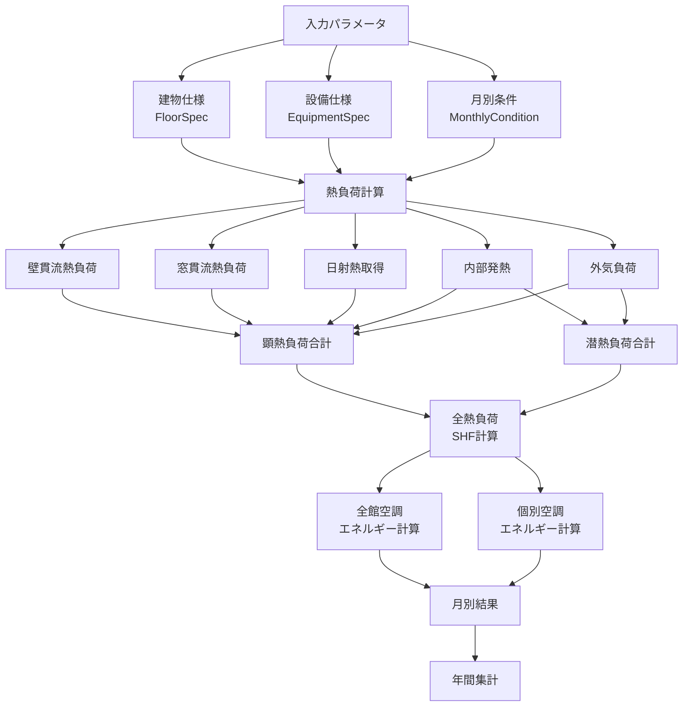

# ビルエネルギーシミュレーション 計算理論

## 目次

1. [概要](#概要)
2. [建物熱負荷計算](#建物熱負荷計算)
3. [空調システム計算](#空調システム計算)
4. [計算フロー](#計算フロー)
5. [パラメータ一覧](#パラメータ一覧)

## 概要

本シミュレーターは、オフィスビルの月別エネルギー消費量を予測するためのツールです。建物の熱負荷を計算し、全館空調システム（外調機＋熱源）と個別空調システムのエネルギー消費量を算出します。

### 計算対象

- **全館空調システム**
  - 外調機（AHU: Air Handling Unit）
  - 熱源機器（チラー）
- **個別空調システム**
  - 個別パッケージエアコン
- **その他**
  - 照明
  - OA機器

## 建物熱負荷計算

### 1. 壁・窓からの貫流熱負荷

#### 壁貫流熱負荷

```
Q_wall = U_wall × A_wall × (T_out - T_in) [W]
```

**記号説明:**
- `Q_wall`: 壁貫流熱負荷 [W]
- `U_wall`: 壁の熱貫流率 [W/m²K]
- `A_wall`: 壁面積 [m²]
- `T_out`: 外気温度 [°C]
- `T_in`: 室内温度 [°C]

**実装:** `building_energy_model.py:138-140`

#### 窓貫流熱負荷

```
Q_window = U_window × A_window × (T_out - T_in) [W]
```

**記号説明:**
- `Q_window`: 窓貫流熱負荷 [W]
- `U_window`: 窓の熱貫流率 [W/m²K]
- `A_window`: 窓面積 [m²]

**実装:** `building_energy_model.py:143-145`

### 2. 日射熱取得

```
Q_solar = SC × A_window × I_solar [W]
```

**記号説明:**
- `Q_solar`: 日射熱取得 [W]
- `SC`: 日射熱取得係数（Solar Heat Gain Coefficient）
- `I_solar`: 日射強度 [W/m²]（月別に設定）

**月別日射強度の例:**
- 1月: 100 W/m²
- 7月: 400 W/m²

**実装:** `building_energy_model.py:148-151`

### 3. 内部発熱

#### 照明発熱

```
Q_lighting = W_lighting × A_floor × η_operation [W]
```

**記号説明:**
- `Q_lighting`: 照明発熱 [W]
- `W_lighting`: 照明電力密度 [W/m²]
- `A_floor`: 床面積 [m²]
- `η_operation`: 利用率

**実装:** `building_energy_model.py:154-156`

#### OA機器発熱

```
Q_oa = W_oa × A_floor × η_operation [W]
```

**記号説明:**
- `Q_oa`: OA機器発熱 [W]
- `W_oa`: OA機器電力密度 [W/m²]

**実装:** `building_energy_model.py:159-161`

#### 人体発熱

**顕熱:**
```
Q_person_sensible = N × 70 × η_operation [W]
```

**潜熱:**
```
Q_person_latent = N × 50 × η_operation [W]
```

**記号説明:**
- `N`: 在室人数
- 70 W/人: 顕熱発生量（標準値）
- 50 W/人: 潜熱発生量（標準値）

**実装:** `building_energy_model.py:164-170`

### 4. 外気負荷

#### 外気顕熱負荷

外調機による外気処理を想定し、外気を室内温度まで冷却・加熱する負荷を計算します。

```
Q_oa_sensible = 1.2 × V_oa × (T_out - T_in) [W]
```

**記号説明:**
- `V_oa`: 外気風量 [m³/h]（= 30 m³/h/人 × 在室人数）
- 1.2: 空気の体積比熱 [kJ/m³K]
- 30 m³/h/人: 一人当たり必要外気量

#### 外気潜熱負荷

```
Q_oa_latent = L × ρ × V_oa × (X_out - X_in) [W]
```

**記号説明:**
- `L`: 水の蒸発潜熱 [2500 kJ/kg]
- `ρ`: 空気密度 [1.2 kg/m³]
- `X_out`: 外気絶対湿度 [kg/kg]
- `X_in`: 室内絶対湿度 [kg/kg]

**実装:** `building_energy_model.py:173-189`

### 5. 総負荷とSHF

#### 顕熱負荷

```
Q_sensible = Q_wall + Q_window + Q_solar + Q_lighting + Q_oa + Q_person_sensible [W]
```

#### 潜熱負荷

```
Q_latent = Q_person_latent + Q_oa_latent [W]
```

#### 全熱負荷

```
Q_total = Q_sensible + Q_latent [W]
```

#### SHF（顕熱比）

```
SHF = Q_sensible / Q_total
```

**実装:** `building_energy_model.py:192-201`

## 空調システム計算

### 1. 全館空調システム

全館空調システムは、外調機（AHU）と熱源機器（チラー）から構成されます。

#### 外調機ファンエネルギー

```
E_ahu_fan = P_fan × h_operation [kWh]
```

**記号説明:**
- `P_fan`: ファン動力 [kW]
- `h_operation`: 運転時間 [h]

**実装:** `building_energy_model.py:204-206`

#### 熱源エネルギー

全熱負荷を処理するために必要な熱源エネルギーを計算します。

```
E_chiller = (Q_total × h_operation) / (1000 × COP_chiller) [kWh]
```

**記号説明:**
- `COP_chiller`: 熱源COP（Coefficient of Performance）
- 1000: W→kW換算

**高効率機器の例:**
- 最新チラー: COP = 4.5～6.0
- 旧式チラー: COP = 2.5～3.5

**実装:** `building_energy_model.py:209-214`

#### 全館空調合計

```
E_central_total = E_ahu_fan + E_chiller [kWh]
```

**実装:** `building_energy_model.py:217`

### 2. 個別空調システム

個別パッケージエアコンによる空調を想定します。

#### 個別空調ファンエネルギー

```
E_local_fan = P_local_fan × h_operation [kWh]
```

**実装:** `building_energy_model.py:220-222`

#### 個別空調圧縮機エネルギー

```
E_local_compressor = (Q_total × h_operation) / (1000 × COP_local) [kWh]
```

**記号説明:**
- `COP_local`: 個別空調COP

**個別空調の特徴:**
- 高効率機: COP = 3.5～4.5
- 標準機: COP = 2.5～3.5
- 部分負荷時の効率低下を考慮

**実装:** `building_energy_model.py:225-230`

#### 個別空調合計

```
E_local_total = E_local_fan + E_local_compressor [kWh]
```

**実装:** `building_energy_model.py:233`

### 3. その他エネルギー

#### 照明エネルギー

```
E_lighting = (W_lighting × A_floor × η_operation × h_operation) / 1000 [kWh]
```

**実装:** `building_energy_model.py:236-238`

#### OA機器エネルギー

```
E_oa = (W_oa × A_floor × η_operation × h_operation) / 1000 [kWh]
```

**実装:** `building_energy_model.py:241-243`

## 計算フロー



**実装:** `building_energy_model.py:250-284`

年間シミュレーションでは、12ヶ月分の計算を繰り返し、月別・年間の結果を出力します。

## パラメータ一覧

### 建物仕様 (FloorSpec)

| パラメータ | 単位 | 説明 | 標準値範囲 |
|-----------|------|------|-----------|
| floor_area | m² | 床面積 | 500～5000 |
| ceiling_height | m | 天井高さ | 2.5～4.0 |
| wall_u_value | W/m²K | 壁熱貫流率 | 0.3～1.0 |
| window_area | m² | 窓面積 | 床面積の10～30% |
| window_u_value | W/m²K | 窓熱貫流率 | 1.5～6.0 |
| solar_heat_gain_coef | - | 日射熱取得係数 | 0.2～0.8 |

**U値が小さいほど断熱性能が高い**

### 設備仕様 (EquipmentSpec)

| パラメータ | 単位 | 説明 | 標準値範囲 |
|-----------|------|------|-----------|
| lighting_power_density | W/m² | 照明電力密度 | 5～20 |
| oa_equipment_power_density | W/m² | OA機器電力密度 | 10～30 |
| central_ahu_capacity | kW | 外調機容量 | - |
| central_ahu_fan_power | kW | 外調機ファン動力 | - |
| central_chiller_capacity | kW | 熱源容量 | - |
| central_chiller_cop | - | 熱源COP | 2.5～6.0 |
| local_ac_capacity | kW | 個別空調容量 | - |
| local_ac_cop | - | 個別空調COP | 2.5～5.0 |
| local_ac_fan_power | kW | 個別空調ファン動力 | - |

**COPが大きいほど効率が高い**

### 月別運用条件 (MonthlyCondition)

| パラメータ | 単位 | 説明 | 標準値範囲 |
|-----------|------|------|-----------|
| month | - | 月 | 1～12 |
| outdoor_temp | °C | 外気温度 | -5～35 |
| outdoor_humidity | % | 外気相対湿度 | 30～80 |
| indoor_temp_setpoint | °C | 室内温度設定 | 20～26 |
| indoor_humidity_setpoint | % | 室内湿度設定 | 40～60 |
| supply_air_temp | °C | 給気温度設定 | 12～25 |
| occupancy | 人 | 在室人数 | - |
| occupancy_rate | - | 利用率 | 0.5～1.0 |
| operation_hours | h | 運転時間 | 100～300 |

### 出力結果

| 項目 | 単位 | 説明 |
|-----|------|------|
| central_ahu_fan_kWh | kWh | 外調機ファンエネルギー |
| central_chiller_kWh | kWh | 熱源エネルギー |
| central_total_kWh | kWh | 全館空調合計 |
| local_fan_kWh | kWh | 個別空調ファンエネルギー |
| local_compressor_kWh | kWh | 個別空調圧縮機エネルギー |
| local_total_kWh | kWh | 個別空調合計 |
| lighting_kWh | kWh | 照明エネルギー |
| oa_equipment_kWh | kWh | OA機器エネルギー |
| total_load_kW | kW | 全熱負荷 |
| shf | - | 顕熱比 |

## 参考文献

1. 日本建築学会「建築設備設計基準」
2. 空気調和・衛生工学会「空気調和設備の計画設計」
3. SHASE-S112「空調負荷計算法」

## 注意事項

- 本シミュレーターは簡易計算モデルであり、詳細設計には専用の熱負荷計算ソフトウェアの使用を推奨します
- 外気風量は一人当たり30 m³/hの固定値を使用していますが、実際には建築基準法や換気回数による計算が必要です
- 日射強度は簡易的な月別固定値を使用していますが、実際には方位、時刻、天候による変動を考慮する必要があります
